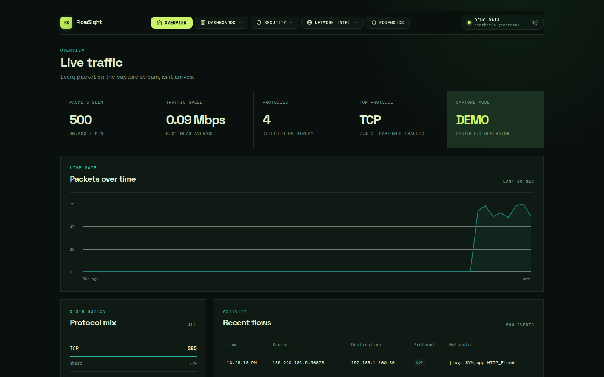
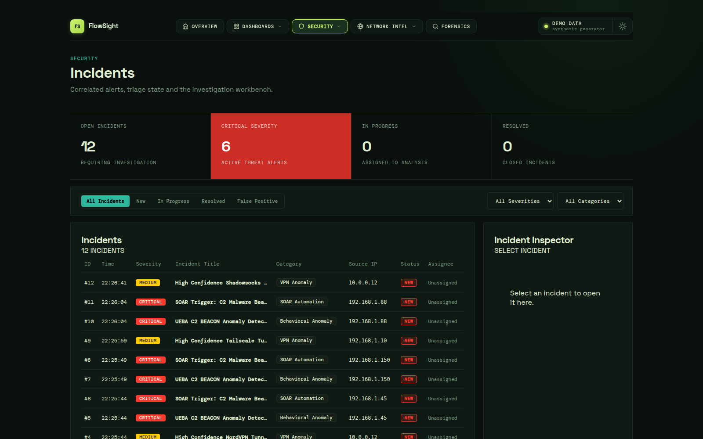
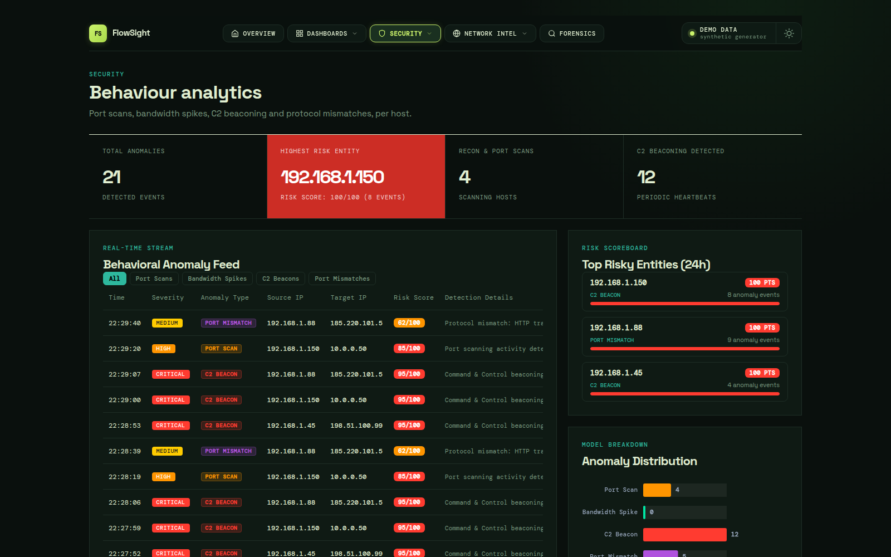
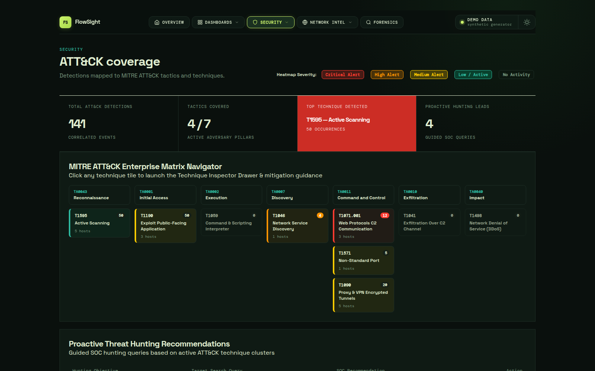
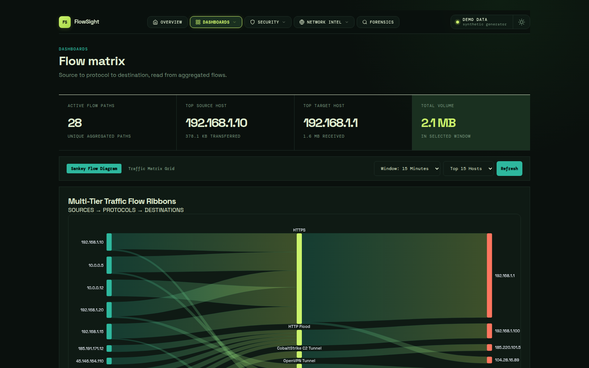
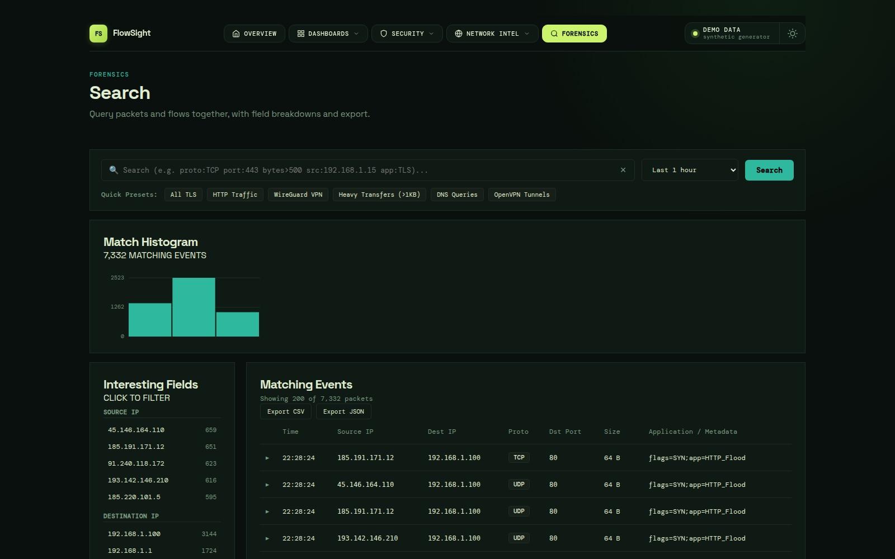

# FlowSight

[](LICENSE)
[](https://nodejs.org)
[](#requirements)

Real-time network flow monitoring and visualisation. A C++ libpcap sniffer feeds a
TypeScript/Express server over a line-oriented pipe; the server persists to SQLite,
runs its detection engines inline, and streams live events to a no-build browser
dashboard over Server-Sent Events.

```
cpp-sniffer/packet_sniffer  --stdout-->  src/index.ts  --SSE-->  public/*.js
   (libpcap, 256MB ring)       [IPFIX]     (express)   /api/stream
                                              |
                                    SQLite: packets (recent)
                                            flows   (aggregated)
```



## Dashboard

Seventeen pages, all served statically with no build step: overview, alerts, incidents,
threat intelligence, DDoS, UEBA, VPN/proxy detection, MITRE ATT&CK coverage, compliance,
forensics search, application and L7 breakdowns, DNS, ASN, GeoIP and a traffic matrix,
plus a 3D globe. Each subscribes to `/api/stream` for live packets and polls its own REST
endpoints for the rest.

| | |
|---|---|
| **Incidents** — correlated alerts, triage state and the investigation workbench<br> | **Behaviour analytics** — port scans, bandwidth spikes, C2 beaconing, protocol mismatches<br> |
| **ATT&CK coverage** — detections mapped onto tactics and techniques<br> | **Flow matrix** — source → protocol → destination, read from aggregated flows<br> |
| **Forensics search** — one query across both storage tiers, with field breakdowns and CSV/JSON export<br> | **Threat intelligence, DDoS, VPN, compliance, GeoIP, DNS, ASN, Layer 7** and a live globe fill out the rest. |

<sub>Screenshots are from `DISABLE_SNIFFER=1` demo mode — the status rail reads
"Demo data" because the packets come from the built-in generator rather than an
interface.</sub>

## Storage tiers

Packets are kept for `PACKET_RETENTION_HOURS` (default 6) to serve the live tail and
deep forensics, then rolled up into hourly-bucketed 5-tuple flow records for long
retention. Flow retention follows `compliance_settings.retention_days`.

Measured on a real 3.3M-packet capture, the roll-up reduced the database from 802 MB to
16 MB — 55x fewer rows — with byte and packet totals preserved exactly. Forensics search
spans both tiers, so the boundary is invisible; results carry a `tier` field and the
number of packets each row represents. `/api/flows/stats` reports roll-up health.

## Requirements

| Dependency | Why | Install |
|---|---|---|
| Node.js >= 22.5 | `node:sqlite` is used for persistence | `nvm install 22` (selected automatically at start) |
| `libpcap-dev`, `libssl-dev` | building the sniffer | `sudo apt install libpcap-dev libssl-dev` |
| `libmaxminddb-bin` | GeoIP lookups (`mmdblookup`) | `sudo apt install libmaxminddb-bin` |

If no suitable runtime can be found, `npm start` says so plainly instead of failing
with `ERR_UNKNOWN_BUILTIN_MODULE: No such built-in module: node:sqlite`, which reads
like a missing package rather than a version problem.

## Quick start

```sh
npm install
npm start
```

`npm start` selects a Node >= 22.5 runtime itself (via `nvm` if the shell's default is
older), so no `nvm use` step is required.

The dashboard binds `127.0.0.1:5900` by default. Override with `PORT` and `HOST`.

### From the published package

Released versions are published to GitHub Packages. Point npm at that registry for the
`@novicecoder10` scope and install:

```sh
echo "@novicecoder10:registry=https://npm.pkg.github.com" >> .npmrc
npm install @novicecoder10/flowsight
npx flowsight
```

GitHub Packages requires authentication even for public packages, so `npm login
--registry=https://npm.pkg.github.com` (or a `NODE_AUTH_TOKEN` with `read:packages`)
is needed first. The package ships the built server, the dashboard and the sniffer
sources; it keeps its database in `data/` under the working directory. Building the
sniffer for live capture still means running `make` in `cpp-sniffer/`, so cloning the
repository is the better path if you intend to capture rather than to try the demo.

### Development without packet capture

```sh
DISABLE_SNIFFER=1 npm start
```

Runs a synthetic traffic generator in place of the sniffer — normal baseline traffic
plus periodic attack bursts, enough to exercise the DDoS, threat-intel, UEBA, incident
and SOAR paths. Needs no root and no capabilities. This is the recommended way to work
on anything that is not the capture path itself.

### Live capture

Build the sniffer with the Makefile (the CMake recipe emits into `build/`, where the
server does not look for it):

```sh
sudo apt install libpcap-dev libssl-dev
cd cpp-sniffer && make        # produces cpp-sniffer/packet_sniffer
```

Then grant it raw-socket capability, once per build:

```sh
sudo setcap cap_net_raw,cap_net_admin+eip cpp-sniffer/packet_sniffer
```

**Re-run `setcap` after every rebuild** — a fresh binary does not inherit file
capabilities, and the only symptom is
`Couldn't activate interface any (code -8): socket: Operation not permitted`
with an empty packet history.

Start the dashboard as a normal user, never under `sudo`. It spawns the sniffer itself,
so there is no separate command to run in normal use:

```sh
npm start
SNIFFER_DEVICE=enp6s0 npm start    # capture one interface instead of `any`
```

The sniffer is also a standalone program, which is the quickest way to tell a capture
problem apart from a dashboard problem:

```sh
cd cpp-sniffer
./packet_sniffer                   # capture on 'any', print packets to stdout
./packet_sniffer enp6s0 | head     # one interface, first few lines
```

Each line is `[IPFIX] src_ip=…,dst_ip=…,proto=…,src_port=…,dst_port=…,meta=…,bytes=…` on
stdout; status and errors go to stderr. If lines appear here but the dashboard stays
empty, the problem is the server, not capture. See
[`cpp-sniffer/README.md`](cpp-sniffer/README.md) for the build, capability and output
details.

`scripts/`  holds the runtime selector used by the `build` and `start` scripts.

## Tests

```sh
npm test
```

Covers HTML-escaping of attacker-controlled packet metadata in the browser renderer,
and the packet parser's handling of hostile input (metadata injection, truncated
transport headers, oversized fields, IPv6 port extraction).

## Security notes

FlowSight renders data that arrives from the network, so the threat model includes the
traffic it monitors.

- **Bind address.** Defaults to loopback. Exposing the dashboard on `0.0.0.0` publishes
  your full packet-capture history; set `HOST` deliberately.
- **Authentication.** Set `FLOWSIGHT_TOKEN` to require `Authorization: Bearer <token>`
  (or `?token=`) on every request. Unset means no authentication.
- **Webhooks.** SOAR webhook URLs are operator-supplied and dispatched from this host.
  Private, loopback and link-local destinations are refused unless
  `SOAR_ALLOW_PRIVATE_WEBHOOKS=1` is set.
- **Blocklist export.** `/api/soar/export-blocklist` emits iptables/ipset/Cisco rules.
  FlowSight records shunned addresses but never modifies your firewall — applying the
  export is a deliberate operator step.
- **ASN enrichment.** `/api/asn` forwards observed addresses to RIPEstat, a third party.

## Configuration

| Variable | Default | Purpose |
|---|---|---|
| `PORT` | `5900` | Dashboard HTTP port |
| `HOST` | `127.0.0.1` | Bind address |
| `FLOWSIGHT_TOKEN` | — | Enables bearer-token auth when set |
| `DISABLE_SNIFFER` | — | `1` swaps capture for the synthetic generator |
| `SNIFFER_BIN` | `cpp-sniffer/packet_sniffer` | Sniffer binary path |
| `SNIFFER_DEVICE` | `any` | Interface to capture |
| `FLOWSIGHT_DB` | `data/flowsight.sqlite` | SQLite database path (falls back to `data/ipfixmon.sqlite` if that file exists, from before the rename) |
| `GEOIP_MMDB` | `data/dbip-city-lite.mmdb` | MaxMind-format GeoIP database |
| `SOAR_WEBHOOK_TIMEOUT_MS` | `5000` | Webhook dispatch timeout |
| `SOAR_ALLOW_PRIVATE_WEBHOOKS` | — | `1` permits RFC1918/loopback webhook targets |
| `SOAR_DEFAULT_WEBHOOK` | — | Webhook URL for the seeded default rules |
| `PACKET_RETENTION_HOURS` | `6` | Age at which packets roll up into flows |
| `ROLLUP_INTERVAL_MIN` | `10` | Roll-up job interval |
| `ROLLUP_BATCH_SIZE` | `50000` | Packets aggregated per transaction |
| `FLOW_METADATA_CAP` | `8` | Distinct metadata values kept per flow |
| `MAX_TRACKED_HOSTS` | `20000` | Cap on per-host detector state |
| `MAX_LOOKUP_CACHE` | `10000` | Cap on GeoIP/DNS/ASN caches |
| `DDOS_PPS_THRESHOLD`, `DDOS_BPS_THRESHOLD`, `DDOS_SUSTAINED_SEC` | see `src/index.ts` | DDoS trigger tuning |

The GeoIP database (`data/dbip-city-lite.mmdb`, DB-IP City Lite, CC BY 4.0) is not
committed because of its size. Point `GEOIP_MMDB` at any MaxMind-format database.

## Layout

```
src/index.ts        server, detection engines and REST API
src/rollup.ts       flow aggregation and retention enforcement
cpp-sniffer/        libpcap capture, L7 metadata extraction
public/             dashboard pages (no build step, no framework)
tests/              regression tests
data/               SQLite database and GeoIP data (gitignored)
```

## License

MIT — Copyright (c) 2026 Gautam Karat. See [LICENSE](LICENSE).

The bundled GeoIP database (DB-IP City Lite, not committed) is CC BY 4.0 and is
attributed to DB-IP separately; threat-intelligence feeds are fetched at runtime from
their own publishers under their own terms.
